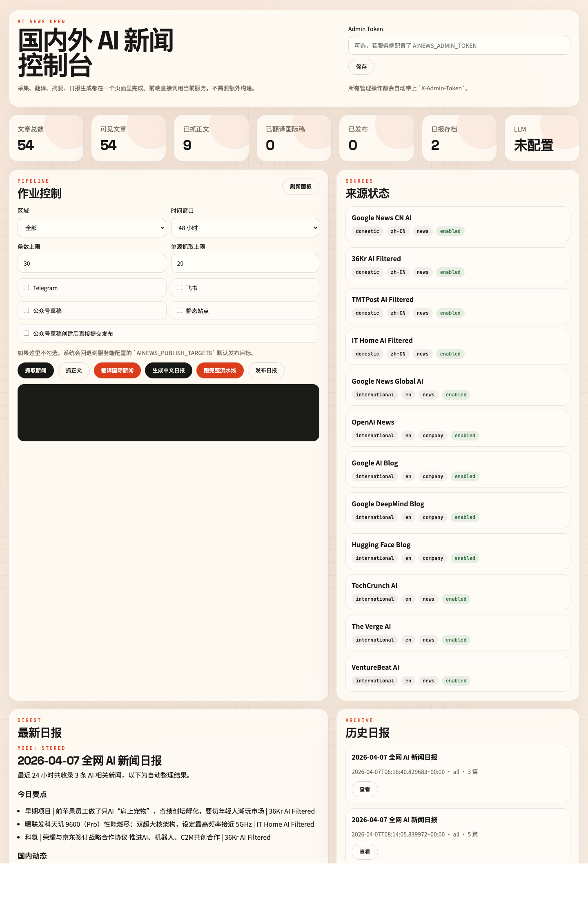
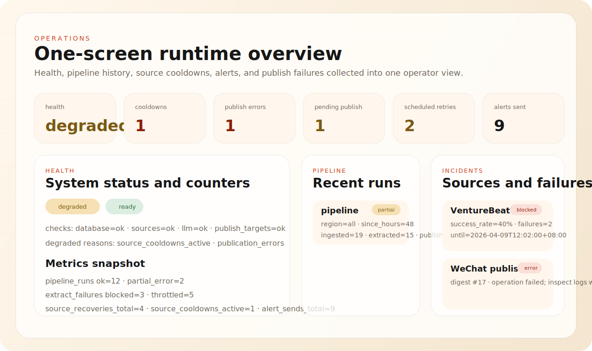

<div align="center">
  <h1>AI News Open</h1>
  <p><strong>开源的国内外 AI 新闻聚合、中文翻译日报与多渠道发布工具</strong></p>
  <p><a href="README.md">English</a> · <a href="README.zh-CN.md">简体中文</a></p>
  <p>
    <a href="https://github.com/X-PG13/ainews-open/actions/workflows/ci.yml"></a>
    <a href="https://github.com/X-PG13/ainews-open/releases"></a>
    <a href="LICENSE"></a>
    <a href="pyproject.toml"></a>
  </p>
  <p>
    <a href="https://github.com/X-PG13/ainews-open">Repository</a> ·
    <a href="https://github.com/X-PG13/ainews-open/releases">Releases</a> ·
    <a href="docs/github-launch-kit.md">Launch Kit</a> ·
    <a href="docs/demo/index.html">Demo</a>
  </p>
</div>




## 产品概览

AI News Open 是一个面向开源发布的 AI 新闻聚合工具。它把分散的国内外 AI 信息源整理成一条完整工作流：采集、清洗、去重、正文提取、国际新闻中文翻译、日报生成、存档和多渠道发布。

## 为什么存在

- 国内外 AI 新闻统一采集，不依赖付费新闻 API
- 国际新闻自动转中文标题、摘要和“为什么重要”
- 同时提供 CLI、FastAPI API、零构建后台和多渠道发布
- 已补齐 CI、lint、测试、Docker、Issue/PR 模板、安全策略等开源工程基线

## 你能交付什么

| 层级 | 已包含 |
| --- | --- |
| Sources | 国内外 RSS/Atom 新闻源 registry |
| Processing | 清洗、去重、正文提取、翻译增强、日报生成 |
| Interfaces | CLI、FastAPI API、零构建管理台 |
| Publishing | Telegram、飞书、静态站点、微信公众号草稿/发布 |
| Engineering | 测试、lint、pre-commit、CI、Docker、changelog、安全策略 |

## 适用场景

- 个人维护 AI 新闻日报
- 内容团队做国际 AI 新闻中文编译
- 轻量化 AI 媒体或内部情报流转
- 把日报自动分发到 Telegram、飞书、静态站点或公众号

## 60 秒上手

```bash
python3 -m venv .venv
source .venv/bin/activate
python -m pip install .
cp .env.example .env
python -m ainews run-pipeline --since-hours 48 --limit 30 --max-items 30 --use-llm --persist --export
python -m ainews serve --port 8000
```

启动后你可以：

- 在 `http://127.0.0.1:8000/` 打开控制台
- 直接在 Operations 总览里查看 `/health`、最近 pipeline、来源冷却、来源告警和发布失败
- 查看新闻池、日报存档、发布历史和微信发布状态
- 直接从控制台触发抓取、翻译、生成日报和发布
- 把预览冻结成可编辑发布稿，调整排序、分组、发布标题和摘要，然后按冻结稿发布而不是实时重算

## 公开 Demo

- 示例页面：[docs/demo/index.html](docs/demo/index.html)
- 示例日报 Markdown（中文）：[docs/demo/sample-digest.md](docs/demo/sample-digest.md)
- 示例日报 Markdown（英文）：[docs/demo/sample-digest.en.md](docs/demo/sample-digest.en.md)
- 示例日报 JSON：[docs/demo/sample-digest.json](docs/demo/sample-digest.json)
- 示例健康检查返回：[docs/demo/sample-health.json](docs/demo/sample-health.json)
- 示例运维聚合返回：[docs/demo/sample-operations.json](docs/demo/sample-operations.json)
- 示例发布记录：[docs/demo/sample-publications.json](docs/demo/sample-publications.json)

## 维护者工作流

```bash
python -m pip install -e ".[dev]"
pre-commit install
make check
```

`make check` 现在就是本地维护者总门禁，会一次跑完 lint、coverage、构建校验和 `/health` smoke。只有在你单独调某一层时，才需要单跑 `make coverage` 或 `make smoke`。

## 运维与交付文档

- [兼容性约定](docs/compatibility.md)
- [配置矩阵](docs/configuration.zh-CN.md)
- [首次部署指南](docs/first-deploy.zh-CN.md)
- [部署指南](docs/deployment.zh-CN.md)
- [数据库迁移](docs/database-migrations.md)
- [故障排查](docs/troubleshooting.zh-CN.md)
- [监控接入](docs/monitoring.zh-CN.md)
- [PR 审核约定](docs/pr-review-policy.zh-CN.md)
- [Release 产物校验](docs/release-artifacts.zh-CN.md)
- [使用场景](docs/use-cases.zh-CN.md)
- [贡献者手册](docs/contributor-playbook.md)
- [发版清单](docs/release-checklist.zh-CN.md)
- [支持策略](SUPPORT.md)
- [路线图](ROADMAP.md)

## 当前能力

当前版本提供：

- 国内/国际 AI 新闻源 registry，默认混合中文站点、国际媒体和官方博客
- RSS/Atom 采集、基础清洗、去重入库
- 基于 `canonical_url`、`resolved_target`、标准化标题和内容指纹的跨源重复簇归并
- 文章正文抓取、source-specific 清洗与本地持久化
- 国际新闻 LLM 翻译与摘要补全
- 中文日报生成与历史存档
- `pin`、`must_include`、`suppress`、重复簇主记录切换、带入选/排除原因的日报编辑预览，以及可冻结的发布前编辑稿能力
- 日报发布层，可推送到 Telegram、飞书、自建静态站点和微信公众号草稿箱
- 飞书卡片消息和微信公众号封面自动上传
- 发布历史管理与微信公众号发布状态刷新
- `FastAPI` HTTP API
- 零构建前端控制台和简单管理后台
- 命令行采集、抓正文、翻译、日报生成、发布、整链路 pipeline
- SQLite 存储
- 单元测试、API 烟雾测试、Dockerfile、CI 工作流
- `ruff`、coverage、`pre-commit`、issue/PR 模板、Security/Code of Conduct 等开源协作基建

默认源地址已在 `2026-04-07` 验证可访问，包括：

- 中文：`36Kr`、`TMTPost`、`IT之家`、`Google News CN AI`
- 国际：`OpenAI News`、`Google AI Blog`、`Google DeepMind Blog`、`Hugging Face Blog`、`TechCrunch AI`、`The Verge AI`、`VentureBeat AI`、`Google News Global AI`

## 设计原则

这个版本优先解决四个问题：

1. 不依赖付费新闻 API，默认只用公开 RSS/Atom 源。
2. 能直接扩展，所有默认源都在 `src/ainews/sources.default.json` 里维护。
3. 国际新闻可以先抓正文，再通过可配置的 LLM 自动转成中文标题、摘要和“为什么重要”。
4. 能跑成服务，也能跑成命令行任务，还自带前端控制台、发布层和定时工作流，适合本地、服务器、Docker 和 GitHub Actions。

## 项目结构

```text
src/ainews/
  api.py               FastAPI 入口
  cli.py               命令行入口
  config.py            环境变量和配置
  content_extractor.py 正文抓取
  feed_parser.py       RSS / Atom 解析
  http.py              HTTP 拉取
  llm.py               OpenAI-compatible LLM 客户端
  models.py            数据模型
  publisher.py         日报发布层
  repository.py        SQLite 存储
  service.py           采集和聚合服务
  web/                 前端控制台
  sources.default.json 默认新闻源
```

## 快速开始

```bash
python3 -m venv .venv
source .venv/bin/activate
python -m pip install --upgrade pip setuptools wheel
python -m pip install .
cp .env.example .env
python -m ainews ingest
python -m ainews extract --since-hours 48 --limit 20
python -m ainews stats
python -m ainews print-digest --region all --limit 20
python -m ainews publish --use-llm --persist --export --target static_site
python -m ainews serve --port 8000
```

如果你是维护者或准备对外发布仓库，建议额外执行：

```bash
python -m pip install -e ".[dev]"
pre-commit install
make check
```

启动后直接打开：

```text
http://127.0.0.1:8000/
```

如果你更喜欢直接启动 API：

```bash
uvicorn ainews.api:create_app --factory --host 0.0.0.0 --port 8000
```

如果你更希望直接用容器运行：

```bash
docker compose up --build
```

如果你想把 Prometheus 和 Grafana 一起跑起来：

```bash
docker compose --profile monitoring up --build
```

如果你准备二次开发，且本地 `pip` 足够新，可以改用 editable 安装：

```bash
python -m pip install -e ".[dev]"
```

## 开源工程基线

当前仓库已经补齐以下开源工程基线：

- 社区文档：`CONTRIBUTING.md`、`CODE_OF_CONDUCT.md`、`SECURITY.md`、`CHANGELOG.md`
- 协作模板：GitHub issue templates、pull request template、`CODEOWNERS` 和审核约定
- 质量门禁：`ruff` lint、单元测试、coverage、包构建校验、`pre-commit`
- 自动化：CI、tag release workflow、CodeQL、Dependabot
- 发版校验：release artifact checksum 和安装 smoke workflow
- 打包与运行：非 root Docker 运行、`HEALTHCHECK`、`compose.yaml`、`.dockerignore`、`.editorconfig`
- 供应链：release checksums、CycloneDX SBOM、build provenance、PyPI trusted publishing workflow
- 可观测性：Prometheus `/metrics`、来源运行态历史、housekeeping 工作流、可直接运行的 monitoring profile
- Demo：示例站内容、GitHub Pages 工作流、样例 digest/JSON 输出

发布仓库前你还应该确认两件事：

1. 私密漏洞上报入口已经配置到 GitHub Security Advisories。
2. README 和 `pyproject.toml` 中的组织名、仓库地址、维护者信息已经改成真实值。

如果你准备发布到 GitHub，首版 Release 文案和项目简介可直接复用：

- `docs/github-launch-kit.md`
- `docs/project-intro.md`

社区协作建议配套：

- `ROADMAP.md`
- `SUPPORT.md`
- `.github/labels.yml`

## LLM 翻译与日报

如果你希望国际新闻自动转成中文，并由 LLM 生成日报，需要在 `.env` 中配置一组 OpenAI-compatible 参数：

```env
AINEWS_LLM_PROVIDER=openai_compatible
AINEWS_LLM_BASE_URL=你的兼容接口地址
AINEWS_LLM_API_KEY=你的密钥
AINEWS_LLM_MODEL=你的模型名
```

然后执行：

```bash
python -m ainews extract --since-hours 48 --limit 20
python -m ainews enrich --since-hours 48 --limit 20
python -m ainews print-digest --region all --limit 20 --use-llm --persist
```

说明：

- `extract` 会补抓文章正文，供后续翻译和摘要使用。
- `enrich` 只处理国际新闻，给它们补中文标题、中文摘要和中文重要性说明。
- `print-digest --use-llm` 会优先使用已翻译内容生成中文日报。
- 如果 LLM 未配置，系统会回退到规则模板生成 fallback 日报，保证接口仍然可用。

如果你希望一步跑完整链路：

```bash
python -m ainews run-pipeline --since-hours 48 --limit 30 --max-items 30 --use-llm --persist --export
```

它会依次执行：

1. 抓取最新新闻
2. 抓取正文
3. 翻译国际新闻
4. 生成日报
5. 导出 `output/*.md` 和 `output/*.json`

如果你要在同一条流水线里直接发布：

```bash
python -m ainews run-pipeline \
  --since-hours 48 \
  --limit 30 \
  --max-items 30 \
  --use-llm \
  --persist \
  --export \
  --publish \
  --target static_site
```

说明：

- `publish` 和 `run-pipeline --publish` 会自动持久化 digest，以便后续刷新发布状态并启用幂等防重复。
- 同一个已存档 `digest` 发布到同一个 `target` 时，系统默认返回 `skipped`，不会新增脏记录。
- 如果你明确要再次对外推送，可加 `--force-republish`。

## 正文抽取与 source-specific 清洗

正文抽取器默认包含两层策略：

- 通用正文识别：优先 `article`、`main`、`entry-content`、`post-content` 等常见容器
- 站点专用清洗：当前对 `36Kr`、`IT之家` 优先命中正文容器，并主动丢弃推荐阅读、分享栏、面包屑、评论入口等站点噪音

即使运行环境没有安装 `beautifulsoup4`，工具也会回退到标准库解析路径，并继续对 `36Kr`、`IT之家` 做专用正文抽取。

## 日报发布层

当前支持四类发布目标：

- `telegram`：通过 Bot API 推送文本日报
- `feishu`：通过自定义群机器人 webhook 推送，支持 `text` 和 `interactive` 卡片
- `wechat`：写入微信公众号草稿箱，并可选直接提交发布；支持自动上传封面图生成 `thumb_media_id`
- `static_site`：输出零依赖静态页面和 `latest.json`

发布示例：

```bash
python -m ainews publish --use-llm --target telegram
python -m ainews publish --use-llm --target feishu --target static_site
python -m ainews publish --use-llm --target wechat --wechat-submit
python -m ainews publish --digest-id 1 --target static_site --force-republish
```

如果不传 `--target`，系统会读取 `AINEWS_PUBLISH_TARGETS`。

### 飞书卡片

如果你希望默认发卡片而不是纯文本：

```env
AINEWS_FEISHU_MESSAGE_TYPE=card
```

当前实现会优先尝试发送 `interactive` 卡片；如果卡片发送失败，会自动回退到 `text` 消息。

### 微信公众号封面自动上传

如果你不想手工准备 `thumb_media_id`，可以改为提供封面图来源：

```env
AINEWS_WECHAT_APP_ID=你的AppID
AINEWS_WECHAT_APP_SECRET=你的AppSecret
AINEWS_WECHAT_THUMB_IMAGE_PATH=assets/wechat-cover.jpg
# 或
AINEWS_WECHAT_THUMB_IMAGE_URL=https://example.com/wechat-cover.jpg
AINEWS_WECHAT_THUMB_UPLOAD_TYPE=thumb
```

说明：

- `thumb` 模式会走永久素材上传接口的 `type=thumb`，更适合作为封面；按官方要求需要 `JPG` 且不超过 `64KB`
- 如果你已经有现成素材，仍然可以继续直接填 `AINEWS_WECHAT_THUMB_MEDIA_ID`
- 当前实现只自动上传封面素材，不自动改写正文内的外部图片链接

### 微信公众号发布状态刷新

如果你启用了 `--wechat-submit` 或 `AINEWS_WECHAT_PUBLISH_AFTER_DRAFT=true`，系统会把提交发布后的记录存下来，并支持后续轮询正式发布状态。

可以直接用：

```bash
python -m ainews list-publications --target wechat --limit 20
python -m ainews refresh-publications --target wechat --limit 20
```

当前基于微信官方 `freepublish/get` 接口把记录刷新为：

- `pending`：仍在发布中
- `ok`：发布成功
- `error`：原创校验失败、常规失败、审核不通过、发布后删除或封禁

## 前端控制台

根路径 `/` 提供一个开箱即用的后台页面，支持：

- 抓取新闻
- 批量翻译国际新闻
- 批量抓取正文
- 生成和查看日报
- 选择发布目标并直接推送日报
- 查看发布历史并手动刷新微信发布状态
- 查看历史日报
- 对文章做置顶、隐藏和编辑备注

如果你希望给管理接口加一个简单鉴权，可以设置：

```env
AINEWS_ADMIN_TOKEN=your-secret-token
```

前端会自动通过 `X-Admin-Token` 调用管理接口。

## CLI

```bash
python -m ainews ingest
python -m ainews extract --limit 20
python -m ainews enrich --limit 20
python -m ainews print-digest --use-llm --persist
python -m ainews run-pipeline --use-llm --persist --export
python -m ainews publish --use-llm --persist --target static_site
python -m ainews publish --digest-id 1 --target static_site --force-republish
python -m ainews list-digests --limit 10
python -m ainews list-publications --limit 20
python -m ainews refresh-publications --target wechat --limit 20
python -m ainews stats
python -m ainews serve --port 8000
```

## API

### `GET /health`

健康检查。返回 `status`、当前服务 `version`、数据库检查结果和 `schema_version`。

### `GET /sources`

列出当前启用的新闻源。

### `POST /ingest`

触发一次采集。

示例：

```bash
curl -X POST "http://127.0.0.1:8000/ingest?source_id=36kr-ai&source_id=openai-news"
```

### `GET /articles`

获取已经入库的文章。

示例：

```bash
curl "http://127.0.0.1:8000/articles?region=domestic&since_hours=24&limit=20"
```

### `GET /digest/daily`

获取聚合后的日报视图。默认是无副作用读取；如果加上 `use_llm=true`，会尝试用当前配置的 LLM 生成日报。

示例：

```bash
curl "http://127.0.0.1:8000/digest/daily?region=all&since_hours=24&limit=30"
```

### `GET /admin/stats`

获取文章、翻译、日报存档和 LLM 配置状态。

### `POST /admin/enrich`

批量翻译国际新闻。

```bash
curl -X POST "http://127.0.0.1:8000/admin/enrich" \
  -H "Content-Type: application/json" \
  -H "X-Admin-Token: your-secret-token" \
  -d '{"since_hours":48,"limit":20}'
```

### `POST /admin/extract`

批量抓取正文。

```bash
curl -X POST "http://127.0.0.1:8000/admin/extract" \
  -H "Content-Type: application/json" \
  -H "X-Admin-Token: your-secret-token" \
  -d '{"since_hours":48,"limit":20}'
```

### `POST /admin/digests/generate`

生成并可选持久化一份中文日报。

```bash
curl -X POST "http://127.0.0.1:8000/admin/digests/generate" \
  -H "Content-Type: application/json" \
  -H "X-Admin-Token: your-secret-token" \
  -d '{"region":"all","since_hours":48,"limit":20,"use_llm":true,"persist":true}'
```

### `POST /admin/digests/preview`

生成带入选、压制、重复簇次记录、排序落选原因的选稿预览。

### `POST /admin/digests/snapshot`

把当前预览冻结成一份可编辑的日报草稿。可选 `editor_items` 支持覆盖是否入选、手工排序、分组标题、发布标题和发布摘要。

### `PATCH /admin/digests/{digest_id}/editor`

原地更新一份已冻结的编辑稿。之后使用 `digest_id` 发布时，会优先发布这份已确认快照，而不是临时重新计算。

### `PATCH /admin/articles/{id}`

对单条新闻做人工干预，例如隐藏、置顶、补备注。

### `POST /admin/pipeline`

一键执行抓取、正文提取、翻译、日报生成、导出，并可选直接发布。

### `POST /admin/publish`

生成或读取一份日报，并发布到配置好的目标平台。

```bash
curl -X POST "http://127.0.0.1:8000/admin/publish" \
  -H "Content-Type: application/json" \
  -H "X-Admin-Token: your-secret-token" \
  -d '{"targets":["static_site","telegram"],"use_llm":true,"persist":true,"export":true,"force_republish":false}'
```

### `GET /admin/publications`

查看最近的发布记录，包括目标平台、状态、外部 ID 和响应摘要。

支持可选查询参数：

- `digest_id`
- `target`
- `status`

### `POST /admin/publications/refresh`

刷新支持轮询的平台发布状态。当前主要用于微信公众号 `freepublish/get`。

```bash
curl -X POST "http://127.0.0.1:8000/admin/publications/refresh" \
  -H "Content-Type: application/json" \
  -H "X-Admin-Token: your-secret-token" \
  -d '{"target":"wechat","limit":20,"only_pending":true}'
```

## 配置

环境变量示例见 `.env.example`。

- `AINEWS_DATABASE_URL`: SQLite 数据库位置
- `AINEWS_SOURCES_FILE`: 新闻源配置文件
- `AINEWS_HOME`: 工作目录根路径，默认是当前命令执行目录
- `AINEWS_OUTPUT_DIR`: 导出的日报文件目录
- `AINEWS_STATIC_SITE_DIR`: 静态站点输出目录
- `AINEWS_STATIC_SITE_BASE_URL`: 静态站点对外访问基地址，可选
- `AINEWS_REQUEST_TIMEOUT`: 抓取超时秒数
- `AINEWS_DEFAULT_LOOKBACK_HOURS`: 默认回看时间窗口
- `AINEWS_MAX_ARTICLES_PER_SOURCE`: 每个源默认最大采集条数
- `AINEWS_ALLOWED_ORIGINS`: API CORS 白名单
- `AINEWS_ADMIN_TOKEN`: 管理接口 token，可选
- `AINEWS_LOG_LEVEL`: 日志级别，建议 `INFO` 或 `DEBUG`
- `AINEWS_LOG_FORMAT`: 日志格式，支持 `text` 或 `json`
- `AINEWS_EXTRACTION_TEXT_LIMIT`: 单篇正文本地保留的最大字符数
- `AINEWS_LLM_ARTICLE_CONTEXT_CHARS`: 送入 LLM 的正文上下文字符数
- `AINEWS_LLM_PROVIDER`: 当前默认是 `openai_compatible`
- `AINEWS_LLM_BASE_URL`: LLM 接口基地址
- `AINEWS_LLM_API_KEY`: LLM 密钥
- `AINEWS_LLM_MODEL`: LLM 模型名
- `AINEWS_LLM_TIMEOUT`: LLM 调用超时
- `AINEWS_LLM_TEMPERATURE`: 日报和翻译的温度参数
- `AINEWS_LLM_DIGEST_MAX_ARTICLES`: 参与日报生成的最大文章数
- `AINEWS_PUBLISH_TARGETS`: 默认发布目标，逗号分隔，例如 `telegram,static_site`
- `AINEWS_TELEGRAM_BOT_TOKEN`: Telegram bot token
- `AINEWS_TELEGRAM_CHAT_ID`: Telegram chat id 或频道名
- `AINEWS_TELEGRAM_DISABLE_NOTIFICATION`: Telegram 静默推送开关
- `AINEWS_FEISHU_WEBHOOK`: 飞书自定义机器人 webhook
- `AINEWS_FEISHU_SECRET`: 飞书签名秘钥，可选
- `AINEWS_FEISHU_MESSAGE_TYPE`: 飞书消息类型，支持 `text` 或 `card`
- `AINEWS_WECHAT_ACCESS_TOKEN`: 直接指定微信公众号 access token，可选
- `AINEWS_WECHAT_APP_ID`: 用于自动换取 access token 的 AppID
- `AINEWS_WECHAT_APP_SECRET`: 用于自动换取 access token 的 AppSecret
- `AINEWS_WECHAT_THUMB_MEDIA_ID`: 微信图文封面素材 ID，创建草稿时必填
- `AINEWS_WECHAT_THUMB_IMAGE_PATH`: 本地封面图片路径，可替代 `AINEWS_WECHAT_THUMB_MEDIA_ID`
- `AINEWS_WECHAT_THUMB_IMAGE_URL`: 远程封面图片 URL，可替代 `AINEWS_WECHAT_THUMB_MEDIA_ID`
- `AINEWS_WECHAT_THUMB_UPLOAD_TYPE`: 封面上传类型，默认 `thumb`
- `AINEWS_WECHAT_AUTHOR`: 微信图文作者名
- `AINEWS_WECHAT_CONTENT_SOURCE_URL`: 微信图文“阅读原文”地址，可选
- `AINEWS_WECHAT_NEED_OPEN_COMMENT`: 微信图文是否打开评论
- `AINEWS_WECHAT_ONLY_FANS_CAN_COMMENT`: 微信图文是否仅粉丝可评论
- `AINEWS_WECHAT_PUBLISH_AFTER_DRAFT`: 创建草稿后是否自动提交发布

## v1.0 兼容约定

- 导出 JSON 现在包含顶层 `schema_version`
- `publish` 与 `run-pipeline --publish` 默认按“已存档 digest + target”做幂等控制
- 数据库升级按 [Database Migrations](docs/database-migrations.md) 执行，当前 schema version 为 `3`
- 对外兼容承诺见 [Compatibility Contract](docs/compatibility.md)

## 作为开源项目继续增强

当前代码已经具备较完整的开源骨架，但如果你要继续往“生产化”推进，下一步建议做这四件事：

1. 增加来源健康检查、失败重试和抓取监控。
2. 为管理后台补权限体系和多用户编辑日志。
3. 对更多媒体站做专用清洗规则，而不是只覆盖通用 DOM 模式。
4. 接入更多发布目标或更深的平台能力，例如 Telegram 富文本、公众号正文图片自动上传、发布状态轮询。

仓库里已经提供了一个示例工作流：

- [daily-digest.yml](.github/workflows/daily-digest.yml)

它会每天定时执行 `run-pipeline`，并把生成的日报文件作为 artifact 上传。

## 测试

```bash
python -m unittest discover -s tests -v
```

## 许可证

MIT，见 `LICENSE`。
